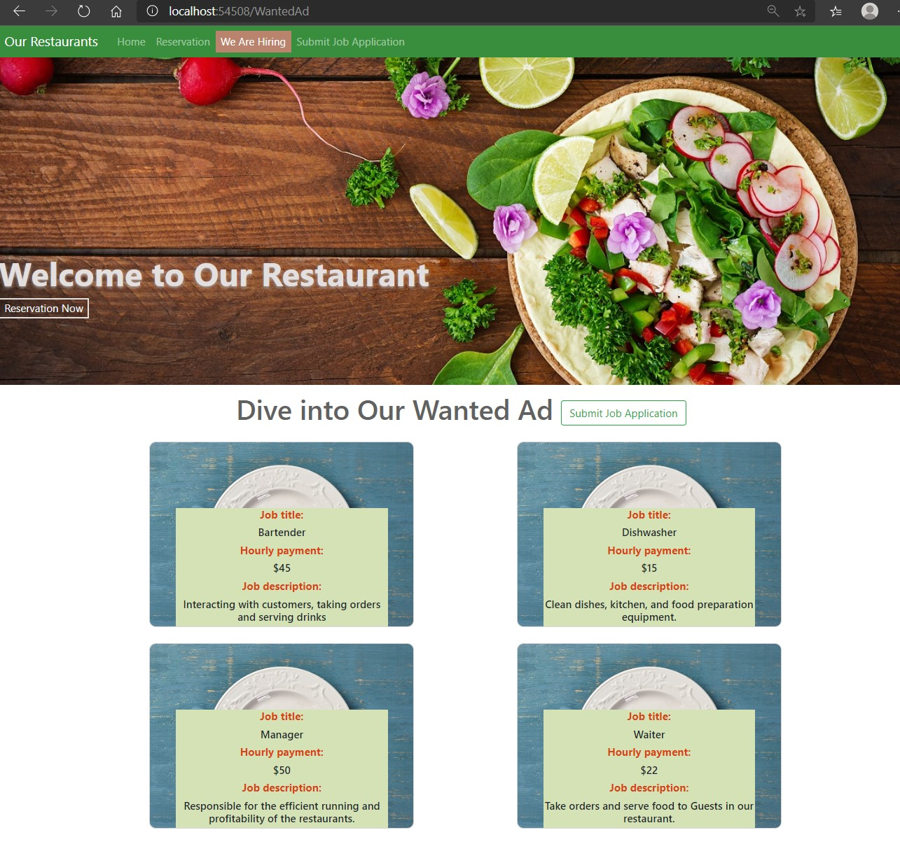
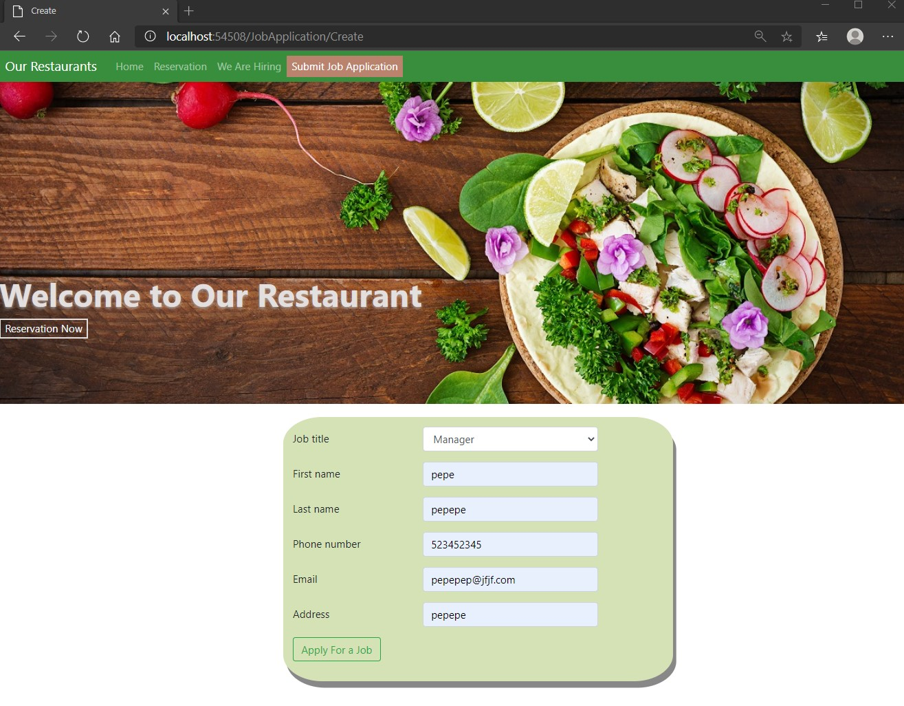
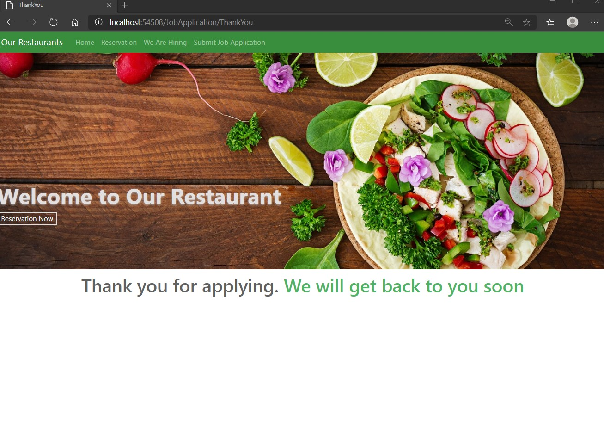

# Module 13: Implementing Web APIs

## Lab: Implementing Web APIs

1. **Nombres y apellidos:** Francisco Javier Moreno Quevedo
2. **Fecha:** 28/12/2020
3. **Resumen del Ejercicio:** implementarla web Api y sus respectivas llamadas desde Jquery o desde Httpclient en el proyecto 3/3
4. **Dificultad o problemas presentados y como se resolvieron:** Ninguna

Ejercicio 3: Calling a Web API by Using jQuery

- Creamos dos ficheros javaScript  **wanted-ad-get.js** y **wanted-ad-post.js** quew realizaran las correspondientes llamadas a la API

- EN el Index.cshtml del wanted referenciamos al fichero **wanted-ad-get.js**

- Ejecutamos y pulsamos We are Hiring y comprobamos los trabajos que hay libres

  

- Añadimos del lado del cliente el controlador JobApplicationController
  - Añadimos su constructor y la accion get Create, PopulateEmployeeRequirementsDropDownListAsyncy ThankYouAsync
- Ejecutamos 

